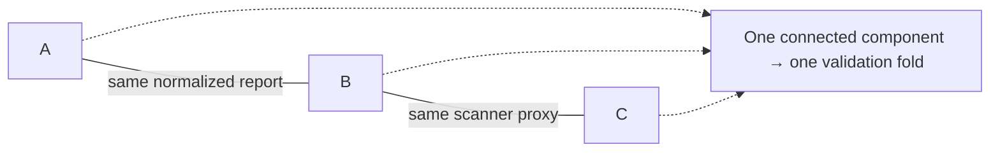

# MRI Validation Audit

**Keep exact duplicate reports and matching scanner proxies together when building validation folds.** A small, inspectable Python tool with a completely synthetic example and no runtime dependencies beyond the standard library.

A random split can separate observations that share an acquisition signature or repeat a report. A combined `(report, scanner)` key also misses mixed chains: A and B may share a report while B and C share a scanner. This tool joins both relations into connected components, assigns complete components to folds, and checks proposed assignments for overlap.



## Run in one minute

Requires Python 3.10 or newer. Clone or download this repository, then run:

```sh
python3 mri_validation_audit.py --demo
python3 -m unittest discover -s tests -v
```

The bundled 10 fictitious observations form six components, including the three-record A–B–C chain. The deterministic three-fold split has validation sizes **4, 3, 3**, and all three overlap counts are zero. The command prints only aggregate statistics and a PASS message. See [the complete expected output](examples/demo_output.txt).

To use a JSON file you are authorized to process locally:

```sh
python3 mri_validation_audit.py --input examples/synthetic_records.json --folds 3
```

Each JSON row has exactly `record_id`, `report` (string or null), and `scanner` (a mapping of caller-selected field names to strings or null). The example's device/protocol names are invented; there is no DICOM adapter or automatic dataset discovery. Apply the same scanner-field schema across the cohort.

## Reusable API

```python
from mri_validation_audit import (
    Record, assign_folds, audit_folds, build_components, require_no_leakage,
)

records = [
    Record("toy-A", "Example alpha", {"device_family": "toy-one"}),
    Record("toy-B", " example ALPHA ", {"device_family": "toy-two"}),
    Record("toy-C", "Example beta", {"device_family": "toy-two"}),
    Record("toy-D", None, {}),
]
components = build_components(records)  # A–B–C and D
folds = assign_folds(records, n_folds=2)
summary = audit_folds(records, folds, n_folds=2)
require_no_leakage(summary)
```

`audit_folds` also accepts your own assignment mapping, so it can catch overlap in an existing split. Record-level IDs, fingerprints, components and assignments are returned only by the Python API for private in-memory use; the CLI neither prints nor saves them. Do not publish API objects from sensitive inputs.

## Method and checks

- **Reports:** Unicode NFKC normalization, case folding and collapsed whitespace, followed by SHA-256. Empty/missing reports create no relation; this detects exact normalized duplicates, not paraphrases.
- **Scanner proxies:** the same value normalization, missing values omitted, sorted structured JSON and SHA-256. Field names remain literal. Structured serialization prevents field/delimiter ambiguity.
- **Grouping:** union-find joins matching reports and matching scanner proxies transitively. Missing values do not connect all unknown observations.
- **Splitting:** a deterministic greedy allocator places the largest complete components first into the currently smallest fold. ID-based ties make the result invariant to input row order. This is an inspectable heuristic, not an optimal bin-packing algorithm or a reimplementation of scikit-learn's `GroupKFold`.
- **Audit:** count report groups, scanner groups and complete components crossing validation folds; verify exact assignment coverage, valid fold numbers and nonempty validation folds. No observations are silently dropped. The allocator rejects too few components for the requested folds; the audit can still diagnose an existing leaking split.

Tests check mixed transitive chains, disconnected/missing observations, Unicode normalization, structured fingerprint encoding, input permutations, complete fold coverage, invalid inputs, deliberate leaking splits, CLI privacy, and independently computed graph components over 100 synthetic randomized cases. These are structural tests; no model is evaluated.

## Limits and responsible use

Matching metadata is a **scanner/protocol proxy**, not a verified patient, scanner instance, hospital or site identity. Different fields, missing metadata or normalization choices can merge unrelated observations or miss genuine relationships. Exact report matches can reflect boilerplate. Fingerprints are not anonymization: a known report can be hashed and linked again.

This tool does not prove patient independence, balance labels or outcomes, establish causal effects, or demonstrate that validation performance predicts a hidden test set. Large components may make folds uneven. Review metadata quality, component sizes and class distributions before training, and prefer verified patient/site groups where available.

This release contains a standalone adaptation and fictitious records. It does not include medical images, headers, real reports or identifiers, competition fold tables, labels, predictions, model weights, or training recipes. Input-data rights remain your responsibility. The **0.940** score recorded elsewhere in the original competition workspace belongs to a separate public model recipe; it is not a result of this audit tool and is not used as evidence for it.

## Origin, contribution and license

The validation-audit idea was documented in **Ou, Y. K. (2026), [Could Your MRI CV Be Learning the Scanner?](https://www.kaggle.com/code/yangkuangou/could-your-mri-cv-be-learning-the-scanner)**, a header-only Kaggle teaching notebook. Its original code and prose carry an Apache-2.0 declaration. This standalone adaptation replaces notebook/data-loading dependencies with a generic record API, unambiguous fingerprints, deterministic component allocation, aggregate CLI output and synthetic regression tests. It does not copy upstream training or report-labeling implementations.

Development of this release's implementation, documentation, synthetic example and tests was assisted by **OpenAI Codex**. The maintainers are responsible for review; this repository does not claim that all code was manually authored or that the audit method is a novel model. See [NOTICE](NOTICE.md) and [source/rights boundaries](SOURCES.md).

The repository's original code and prose are released under [Apache License 2.0](LICENSE). This license does not grant rights to user-provided inputs, competition data, or third-party software.
